# Rest-API-Development_P07_Latihan+Tugas
**Nama: Sherly Agnesya** 
**NIM: 23100019** 
**Mata Kuliah: Pemrograman Berorientasi Objek 2** 
**Kelas: STI-A**  

## **_Latihan 04 - Uji API Latihan 03_**
### 1. Get Book
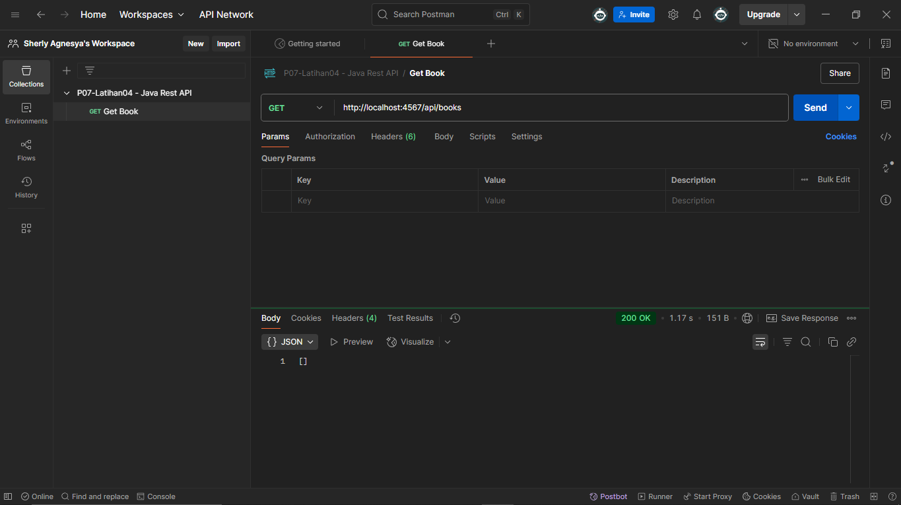

### 2. Get Book 1
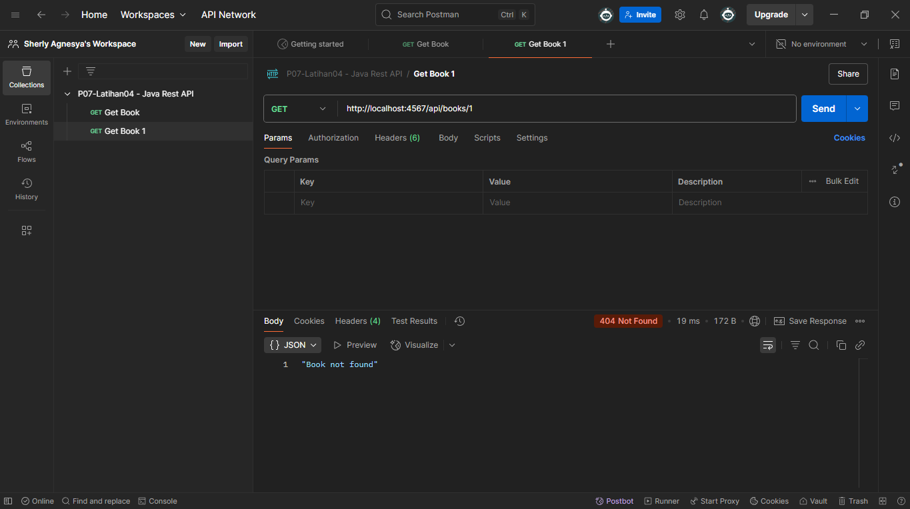

### 3. Post Book (Input Data Buku)
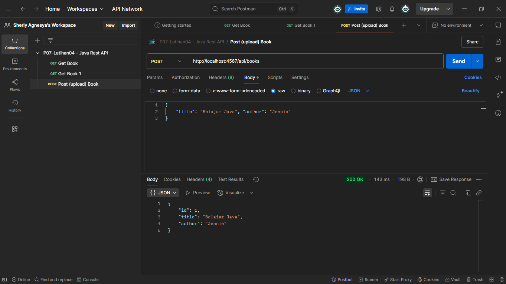

### 4. Put Book (Edit Data Buku)
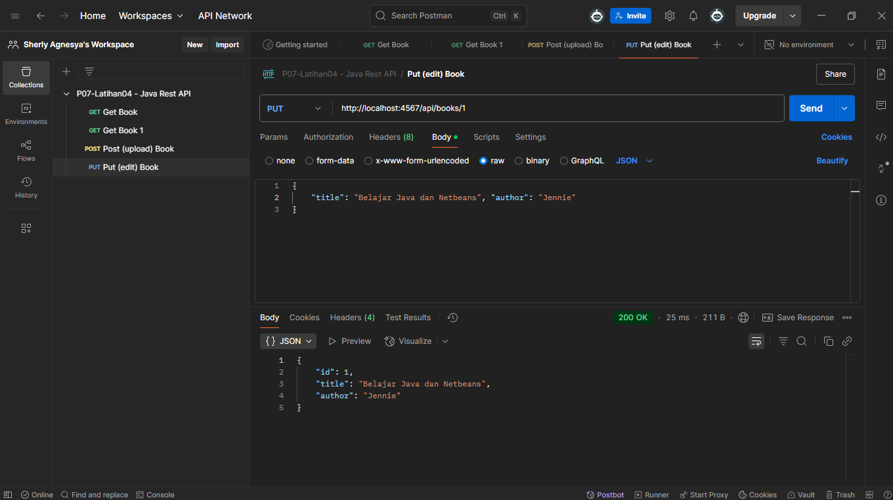

### 5. Delete Book
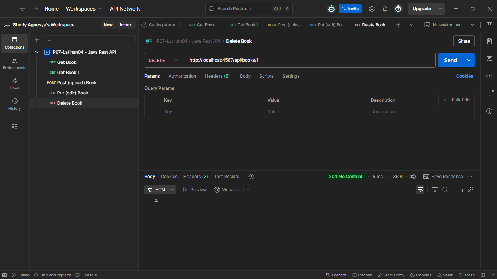

## **_Latihan 05 - Menampilkan tampilan GUI dengan data yang sudah di-input di Postman_**
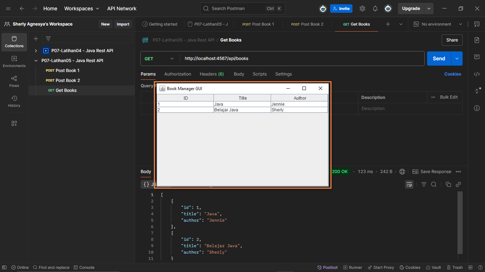

## **_Latihan 06 - Menguji tombol Refresh_**
### 1. Get Book - Sebelum meng-input data
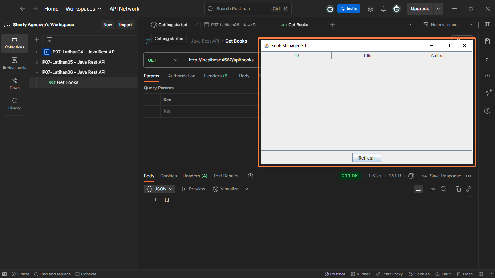

### 2. Get Book - Setelah meng-input data dan melakukan Refresh di-GUI
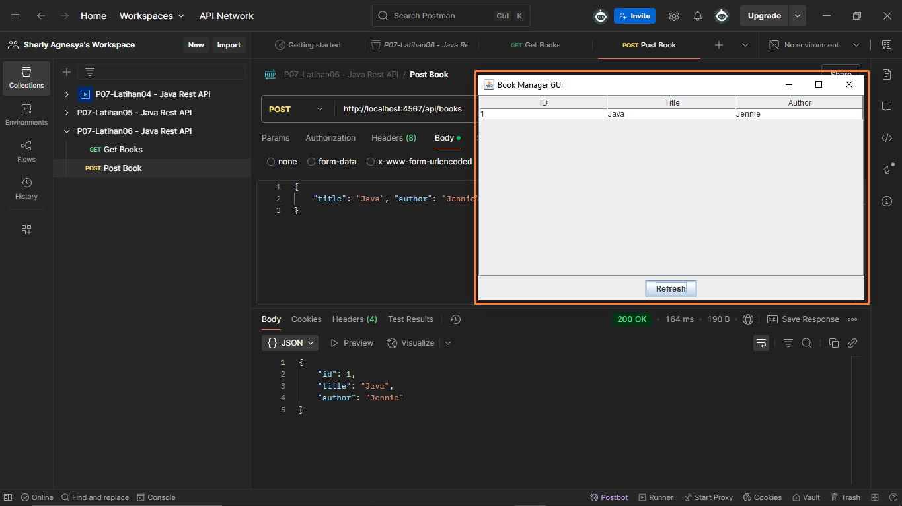

## **_Latihan 07 - Pengujian input data melalui GUI_**
### 1. Tampilan GUI - Sebelum meng-input data
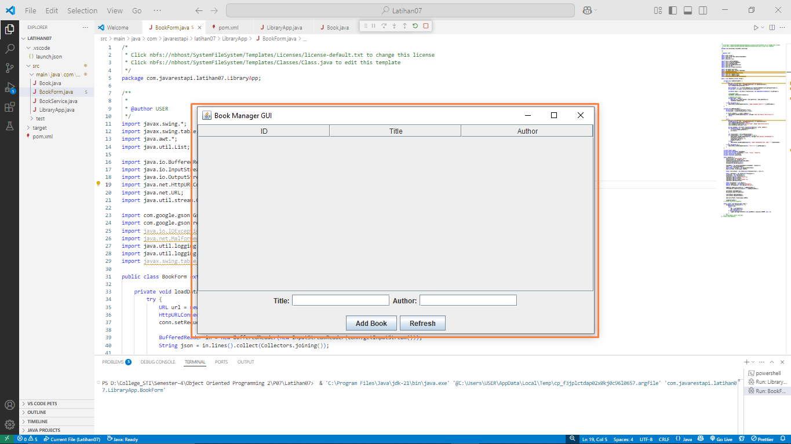

### 2. Tampilan GUI - Meng-input data melalui GUI
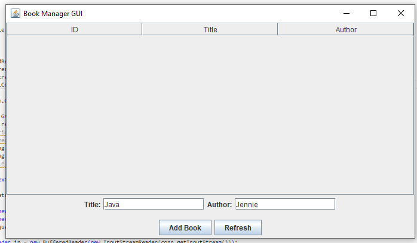
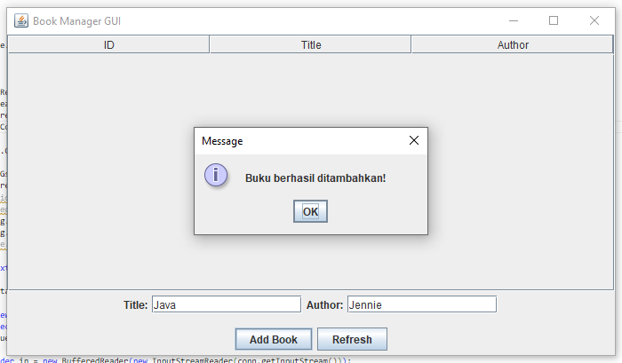
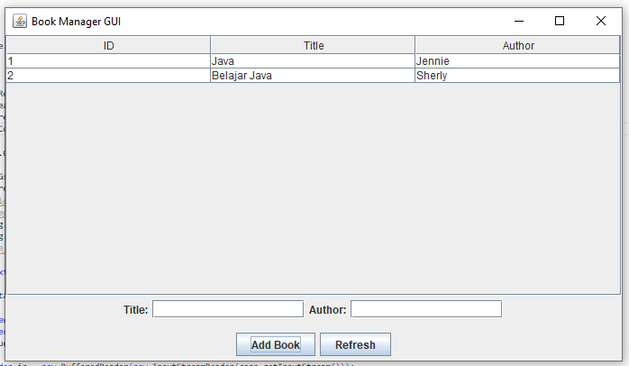

### 3. Get Books - Setelah meng-input data melalui GUI
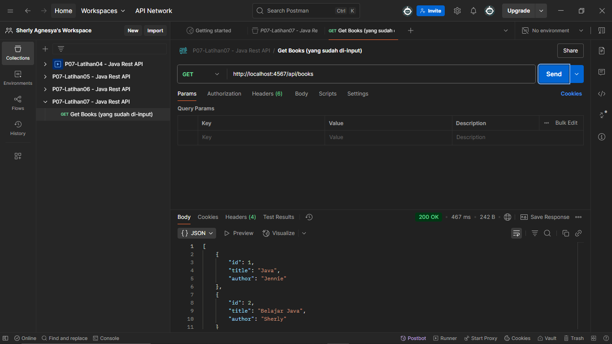

### 4. Get Books - Setelah meng-input semua data melalui GUI
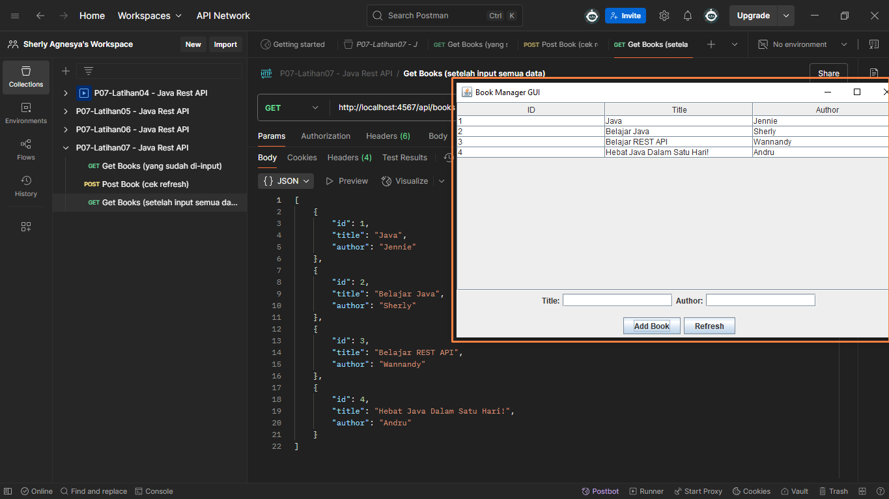

